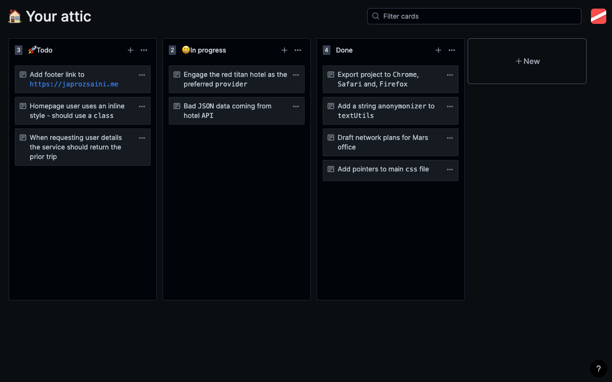
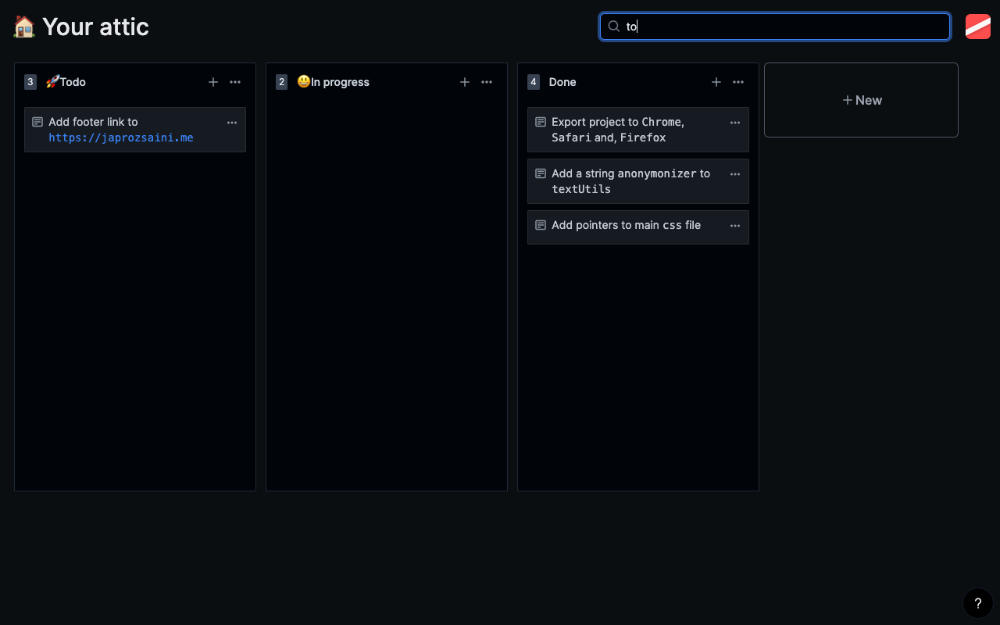
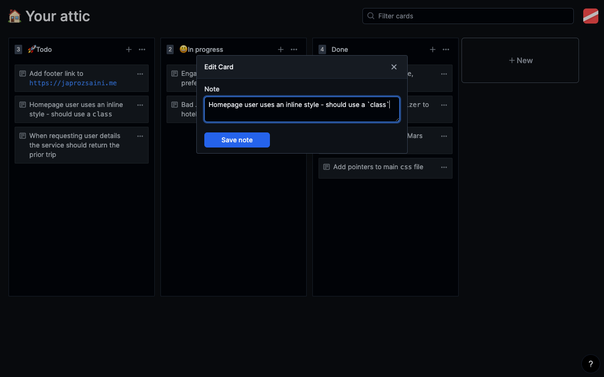
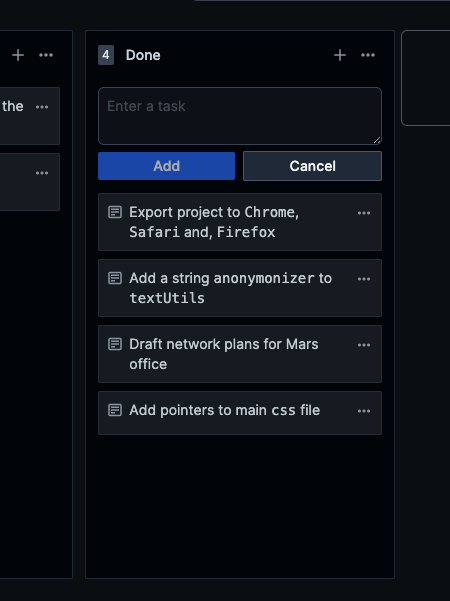
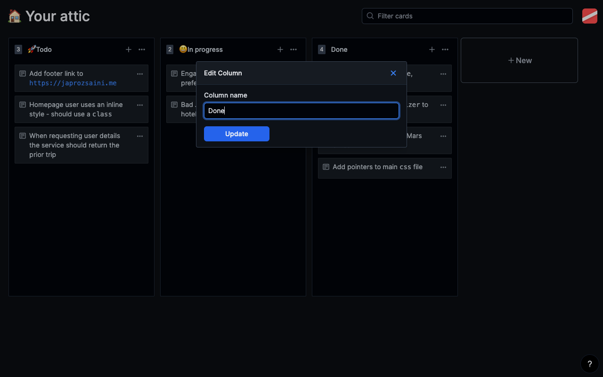

# Attic

`Attic` is a new way to manage your tasks and organise your life efficiently and easily. Instead of going to a website, loggging in, selecting the project and start yout work, just open a new tab to get started with Attic.

## Screenshots

## Features

-   [x] A `kanban` style board and movable/draggable cards
-   [x] Rednering items like `code text` and links
-   [ ] Collapsible boards
-   [ ] Fix UI bugs
